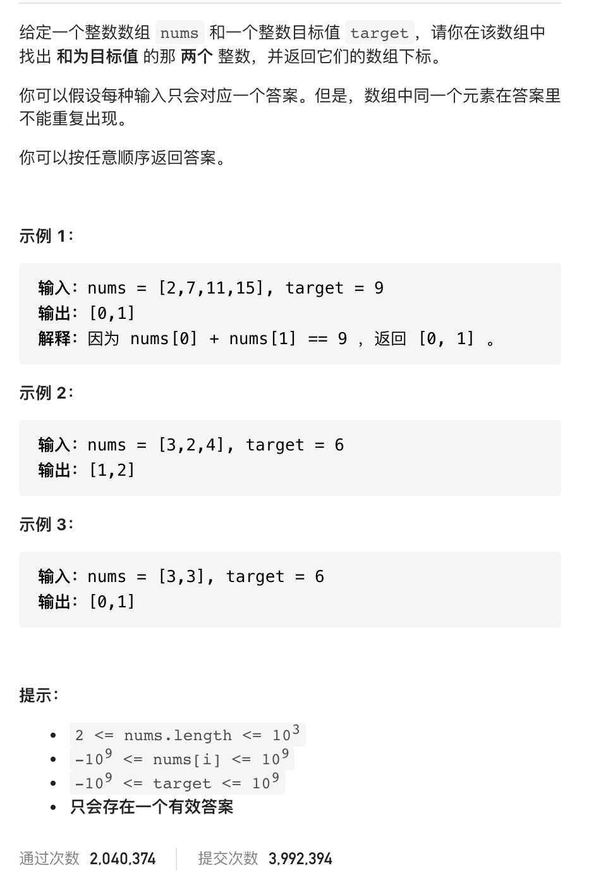

# 1.两数之和

### 难度: 简单

## 题目
------

https://leetcode-cn.com/problems/two-sum/
------

给定一个整数数组 nums 和一个整数目标值 target，请你在该数组中找出 和为目标值 的那 两个 整数，并返回它们的数组下标。

你可以假设每种输入只会对应一个答案。但是，数组中同一个元素在答案里不能重复出现。

你可以按任意顺序返回答案。


## 原题
------


## 解法一
------

```golang
package main

import "fmt"

func twoSum(nums []int, target int) []int {
	indexs := []int{}
	if len(nums) == 0 {
		return nil
	}
	for i := 0; i < len(nums)-1; i++ {
		for j := i + 1; j < len(nums); j++ {
			if nums[i]+nums[j] == target {
				indexs = append(indexs, i)
				indexs = append(indexs, j)
			}
		}
	}
	return indexs
}

func main() {
	fmt.Println("vim-go")
	target := 15
	nums := []int{2, 4, 7, 8, 10, 11, 13, 17, 15}
	ret := twoSum(nums, target)
	fmt.Println("Result:", ret)
}
```

## 解法二
------

```golang
package main

import "fmt"

func twoSum(nums []int, target int) []int {
	indexs := []int{}
	if len(nums) == 0 {
		return nil
	}
	var indexsMap = map[int]int{}
	for i := 0; i < len(nums); i++ {
		anotherNum := target - nums[i]
		value, ok := indexsMap[anotherNum]
		if !ok {
			indexsMap[nums[i]] = i
		} else {
			indexs = append(indexs, i)
			indexs = append(indexs, value)
		}
	}
	return indexs
}

func main() {
	fmt.Println("vim-go")
	target := 15
	nums := []int{2, 4, 7, 8, 10, 11, 13, 17, 15}
	ret := twoSum(nums, target)
	fmt.Println("Result:", ret)
}
```

