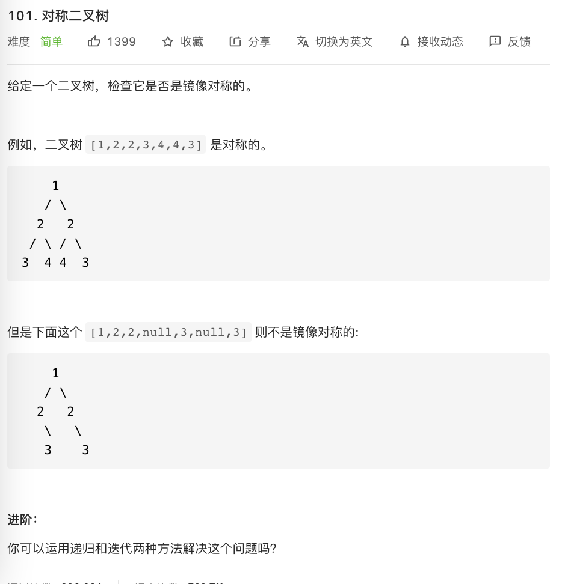

# 101.对称二叉树

### 难度: 简单

## 题目
------

https://leetcode-cn.com/problems/symmetric-tree/
------

## 原题
------


## 解法一
------

```golang
package main

import "fmt"

type TreeNode struct {
	Val   int
	Left  *TreeNode
	Right *TreeNode
}

func NewTreeNode(val int) *TreeNode {
	return &TreeNode{
		Val:   val,
		Left:  nil,
		Right: nil,
	}
}

func IsSymmetric(root *TreeNode) bool {
	return check(root, root)
}

func check(left *TreeNode, right *TreeNode) bool {
	if left == nil && right == nil {
		return true
	}
	if left == nil || right == nil {
		return false
	}
	if left.Val == right.Val {
		return check(left.Left, right.Right) && check(left.Right, right.Left)
	}
	return false
}

func main() {
	fmt.Println("vim-go")

	root := NewTreeNode(1)
	node1 := NewTreeNode(2)
	root.Left = node1
	node2 := NewTreeNode(2)
	root.Right = node2

	node3 := NewTreeNode(3)
	node4 := NewTreeNode(4)
	node1.Left = node3
	node1.Right = node4

	node2.Left = node4
	node2.Right = node3

	// 对称
	fmt.Println(IsSymmetric(root))

	// 不对称
	node2.Right = node4
	fmt.Println(IsSymmetric(root))
}
```

