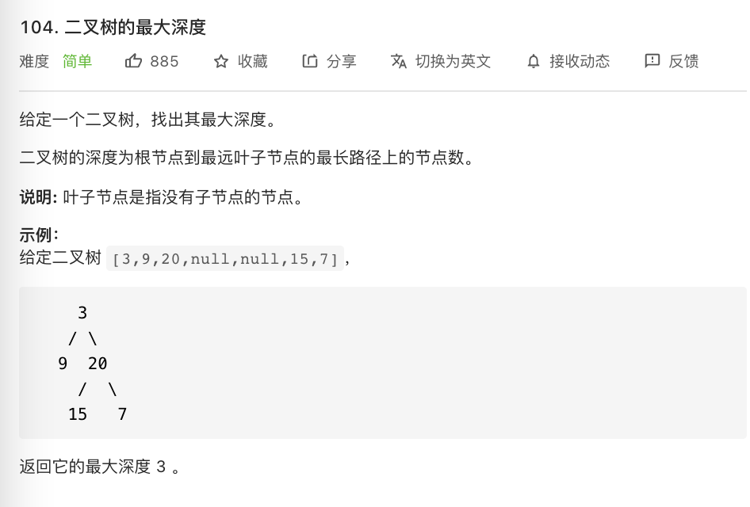

# 104.二叉树的最大深度

### 难度: 简单

## 题目
------

https://leetcode-cn.com/problems/maximum-depth-of-binary-tree/
------

## 原题
------


## 解法一
------

```golang
package main

import "fmt"

type TreeNode struct {
	Val   int
	Left  *TreeNode
	Right *TreeNode
}

func maxDepth(root *TreeNode) int {
	if root == nil {
		return 0
	}
	left := maxDepth(root.Left)
	right := maxDepth(root.Right)
	if left > right {
		return left
	}
	return right
}

func minDepth(root *TreeNode) int {
	if root == nil {
		return 0
	}
	left := maxDepth(root.Left)
	right := maxDepth(root.Right)
	if left < right {
		return left
	}
	return right
}

func main() {
	fmt.Println("vim-go")
}
```

