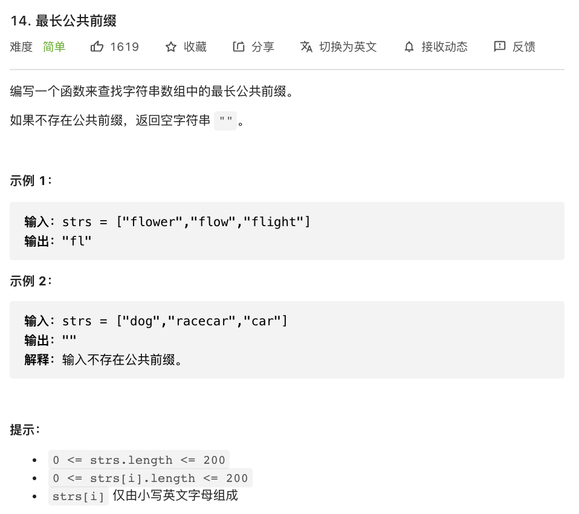

# 14.最长公共前缀

### 难度: 简单

## 题目
------

https://leetcode-cn.com/problems/longest-common-prefix/
------

## 原题
------


## 解法一
------

```golang
package main

import "fmt"

func longestCommonPrefix(strs []string) string {
	var res string = ""

	if len(strs) == 0 {
		return ""
	}

	for i := 0; ; i++ {
		var cur byte = 0 // 每次循环重置 cur 当前要比较的字符
		for _, str := range strs {
			if len(str) <= i {
				return res
			}

			// 每轮循环第一次赋值 cur
			if cur == 0 {
				cur = str[i]
				continue
			}

			// 只要发现有一个字符对比不一样就返回
			if str[i] != cur {
				return res
			}
		}
		// 添加当前字符到相同前缀字符串
		res += string(cur)
	}
}

func main() {
	fmt.Println("vim-go")
	strs := []string{"flower", "flow", "flight"}
	substr := longestCommonPrefix(strs)
	fmt.Println(substr)
}
```

