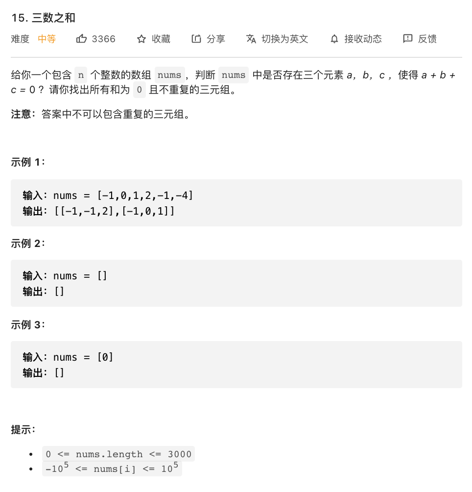

# 15.三数之和

### 难度: 中等

## 题目
------

https://leetcode-cn.com/problems/3sum/
------

## 原题
------


## 解法一
------

```golang
package main

import (
	"fmt"
	"sort"
)

func threeSum(nums []int) [][]int {
	sort.Ints(nums)
	result, start, end, index, addNum, length := make([][]int, 0), 0, 0, 0, 0, len(nums)
	for index = 1; index < length-1; index++ {
		start, end = 0, length-1
		if index > 1 && nums[index] == nums[index-1] {
			start = index - 1
		}
		for start < index && end > index {
			if start > 0 && nums[start] == nums[start-1] {
				start++
				continue
			}
			if end < length-1 && nums[end] == nums[end+1] {
				end--
				continue
			}
			addNum = nums[start] + nums[end] + nums[index]
			if addNum == 0 {
				result = append(result, []int{nums[start], nums[index], nums[end]})
				start++
				end--
			} else if addNum > 0 {
				end--
			} else {
				start++
			}
		}
	}
	return result
}

func threeSum1(nums []int) [][]int {
	res := [][]int{}
	counter := map[int]int{}
	for _, value := range nums {
		counter[value]++
	}
	uniqNums := []int{}
	for key := range counter {
		uniqNums = append(uniqNums, key)
	}
	sort.Ints(uniqNums)
	for i := 0; i < len(uniqNums); i++ {
		if (uniqNums[i]*3 == 0) && counter[uniqNums[i]] >= 3 {
			res = append(res, []int{uniqNums[i], uniqNums[i], uniqNums[i]})
		}
		for j := i + 1; j < len(uniqNums); j++ {
			if (uniqNums[i]*2+uniqNums[j] == 0) && counter[uniqNums[i]] > 1 {
				res = append(res, []int{uniqNums[i], uniqNums[i], uniqNums[j]})
			}
			if (uniqNums[j]*2+uniqNums[i] == 0) && counter[uniqNums[j]] > 1 {
				res = append(res, []int{uniqNums[i], uniqNums[j], uniqNums[j]})
			}
			c := 0 - uniqNums[i] - uniqNums[j]
			if c > uniqNums[j] && counter[c] > 0 {
				res = append(res, []int{uniqNums[i], uniqNums[j], c})
			}
		}
	}
	return res
}

func test() {
	nums1 := []int{-1, 0, 1, 2, -1, -4}
	fmt.Println("nums =", nums1)
	res := threeSum(nums1)
	fmt.Println("res =", res)

	nums2 := []int{}
	fmt.Println("nums =", nums2)
	res1 := threeSum(nums2)
	fmt.Println("res =", res1)

	nums3 := []int{0}
	fmt.Println("nums =", nums3)
	res2 := threeSum(nums3)
	fmt.Println("res =", res2)
}

func test1() {
	nums1 := []int{-1, 0, 1, 2, -1, -4}
	fmt.Println("nums =", nums1)
	res := threeSum1(nums1)
	fmt.Println("res =", res)

	nums2 := []int{}
	fmt.Println("nums =", nums2)
	res1 := threeSum1(nums2)
	fmt.Println("res =", res1)

	nums3 := []int{0}
	fmt.Println("nums =", nums3)
	res2 := threeSum1(nums3)
	fmt.Println("res =", res2)
}

func main() {
	fmt.Println("vim-go")

	test()
	fmt.Println("==========================")
	test1()
}
```

