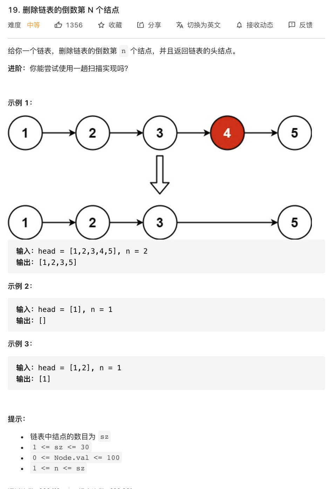

# 19.删除链表的倒数第 N 个结点

### 难度: 中等

## 题目
------

https://leetcode-cn.com/problems/remove-nth-node-from-end-of-list/
------

## 原题
------


## 解法一
------

```golang
package main

import "fmt"

type ListNode struct {
	Val  int
	Next *ListNode
}

// 新建一个节点
func NewNode(val int) *ListNode {
	return &ListNode{
		Val:  val,
		Next: nil,
	}
}

// 后面添加
func (head *ListNode) Add(val int) {
	point := head
	for point.Next != nil {
		point = point.Next
	}
	node := NewNode(val)
	point.Next = node
}

// 删除指定 index  位置元素
func (head *ListNode) Delete(index int) int {
	if index < 0 || index > head.GetLength() {
		return -1
	}
	point := head
	for i := 0; i < index; i++ {
		point = point.Next
	}
	data := point.Next.Val
	point.Next = point.Next.Next
	return data
}

// 在指定 index 位置插入元素
func (head *ListNode) Insert(index int, val int) {
	if index < 0 || index > head.GetLength() {
		fmt.Println("insert value failed")
		return
	}
	point := head
	for i := 0; i < index-1; i++ {
		point = point.Next
	}
	newNode := &ListNode{Val: val}
	newNode.Next = point.Next
	point.Next = newNode
}

// 从链表头部插入一个元素
func (head *ListNode) InsertFromHead(val int) {
	newNode := NewNode(val)
	if head.GetLength() == 1 {
		head.Next = newNode
		return
	}
	newNode.Next = head.Next
	head.Next = newNode
}

// 从链表头部插入一个节点
func (head *ListNode) InsertNodeFromHead(n *ListNode) {
	if head.GetLength() == 0 {
		head.Next = n
		return
	}
	n.Next = head.Next
	head.Next = n
}

// 从链表尾部插入一个元素
func (head *ListNode) InsertFromTail(val int) {
	newNode := NewNode(val)
	point := head
	for point.Next != nil {
		point = point.Next
	}
	point.Next = newNode
}

// 获取链表长度
func (head *ListNode) GetLength() int {
	length := 0
	point := head
	for point.Next != nil {
		point = point.Next
		length += 1
	}
	return length
}

// 从链表尾部插入一个节点
func (head *ListNode) InsertNodeFromTail(n *ListNode) {
	point := head
	for point.Next != nil {
		point = point.Next
	}
	point.Next = n
}

// 初始化数组为链表
func InitLinkNodes(values []int) *ListNode {
	if len(values) == 0 {
		return nil
	}
	head := NewNode(0)
	fmt.Println("初始化链表:", values)
	for i, _ := range values {
		head.Add(values[i])
	}
	return head
}

// 打印链表
func PrintLinkNodes(l *ListNode) {
	if l == nil {
		panic("list is nil")
		return
	}
	point := l.Next
	fmt.Printf("打印链表：")
	for point.Next != nil {
		fmt.Printf("%v -> ", point.Val)
		point = point.Next
	}
	fmt.Printf("%v -> nil\n", point.Val)
}

// 删除链表倒数第 n 个节点
func (head *ListNode) RemoveNthFromEnd(n int) *ListNode {
	var fast, slow *ListNode = head, head
	i := 0
	for fast != nil {
		if i < n+1 {
			fast = fast.Next
			if fast == nil {
				return head
			}
		}
		if i >= n+1 {
			slow = slow.Next
			fast = fast.Next
			if fast == nil {
				p := slow.Next
				slow.Next = p.Next
				return head
			}
		}
		i += 1
	}
	return head
}

func main() {
	fmt.Println("vim-go")
	var nodes1 = []int{1, 2, 3, 4, 5, 6, 7, 8, 9}

	// 链表初始化
	l1 := InitLinkNodes(nodes1)
	PrintLinkNodes(l1)

	// 删除链表倒数第 N 个节点
	l1.RemoveNthFromEnd(2)
	PrintLinkNodes(l1)

	// 扩展：尝试实现删除链表倒数第 N 至倒数第 M 的节点
}
```

