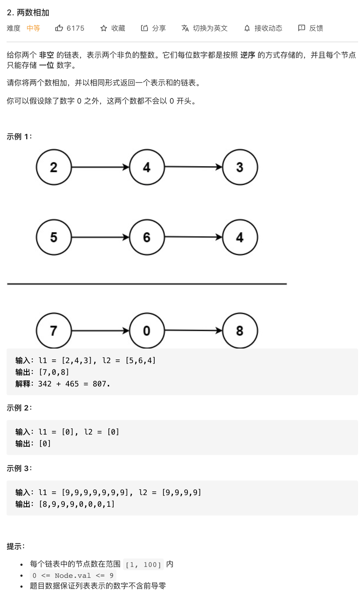

# 1.两数之和

### 难度: 简单

## 题目
------

https://leetcode-cn.com/problems/add-two-numbers/
------

## 原题
------


## 解法一
------

```golang
package main

import "fmt"

type ListNode struct {
	Val  int
	Next *ListNode
}

type LinkNodes interface {
	Add(val int)
	Print()
}

func NewNode(val int) *ListNode {
	return &ListNode{
		Val:  val,
		Next: nil,
	}
}

func (l *ListNode) Add(val int) {
	newNode := NewNode(val)
	if l.Next == nil {
		l.Next = newNode
		return
	}
	newNode.Next = l.Next
	l.Next = newNode
}

func (l *ListNode) AddTail(val int) {
	p := l
	for p.Next != nil {
		p = p.Next
	}
	newNode := NewNode(val)
	p.Next = newNode
}

func (l *ListNode) Print() {
	p := l.Next
	for p != nil {
		fmt.Printf("%v -> ", p.Val)
		p = p.Next
	}
	fmt.Println("nil")
}

func InitLinkNodes(values []int) *ListNode {
	if len(values) == 0 {
		return nil
	}
	head := NewNode(-1)
	for i, _ := range values {
		head.AddTail(values[i])
	}
	head.Print()
	return head
}

func addTwoNumbers(l1 *ListNode, l2 *ListNode) *ListNode {
	var newHead *ListNode = NewNode(-1)
	prev := newHead
	t := 0
	for l1 != nil || l2 != nil || t != 0 {
		if l1 != nil {
			t += l1.Val
			l1 = l1.Next
		}

		if l2 != nil {
			t += l2.Val
			l2 = l2.Next
		}

		prev.Next = NewNode(t % 10)
		prev = prev.Next
		t /= 10
	}
	return newHead.Next
}
```

