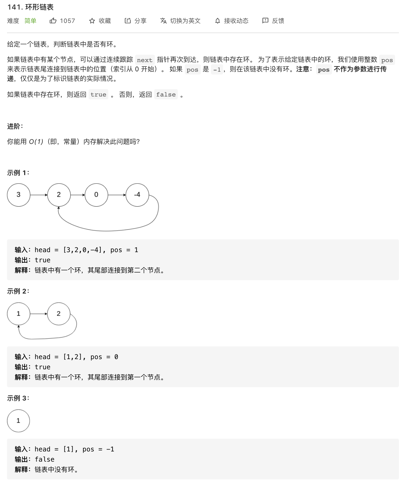
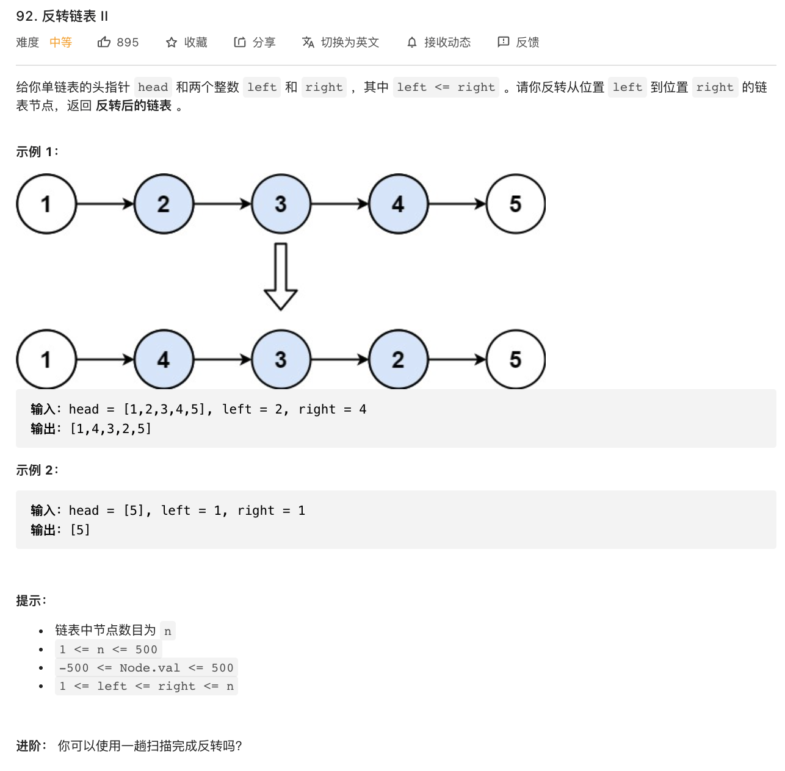
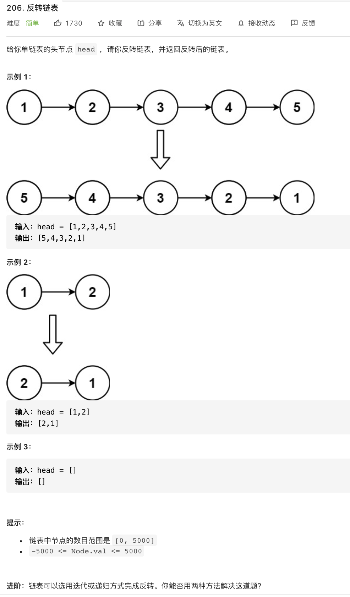

# 21.合并两个有序链表

### 难度: 简单

## 题目
------

https://leetcode-cn.com/problems/merge-two-sorted-lists/
------

## 原题
------


## 题目
------

https://leetcode-cn.com/problems/linked-list-cycle/
------

## 原题
------


## 题目
------

https://leetcode-cn.com/problems/reverse-linked-list-ii/
------

## 原题
------


## 题目
------

https://leetcode-cn.com/problems/reverse-linked-list/
------

## 原题
------



## 实现方法
------

```golang
type ListNode struct {
	Val  int
	Next *ListNode
}

type LinkNoder interface {
	// 后面添加
	Add(val int)
	// 删除指定 index  位置元素
	Delete(index int) int
	// 在指定 index 位置插入元素
	Insert(index int, val int)
	// 从链表头部插入一个元素
	InsertFromHead(val int)
	// 从链表头部插入一个节点
	InsertNodeFromHead(n *ListNode)
	// 从链表尾部插入一个元素
	InsertFromTail(val int)
	// 从链表尾部插入一个节点
	InsertNodeFromTail(n *ListNode)
	// 链表反转
	// Bad method
	Reversed() *ListNode
	// 链表反转1
	Reversed1() *ListNode
	// 链表反转2
	Reversed2() *ListNode
	// 链表反转前 N 个节点
	Reversed3(n int) *ListNode
	// 从链表第 index 个节点开始反转
	ReversedFromIndex(index int)
	// 从链表第 start 个节点开始反转, 到 end 个节点停止反转
	ReversedFromStart2End(start int, end int) *ListNode
	// 获取链表长度
	GetLength() int
	// 查找元素位置
	Search(val int) int
	// 获取指定index位置的元素
	GetVal(index int) int
	// 获取所有的元素
	GetAll() []int
	// 检查单链表中是否存在环
	HasCycle(l *ListNode) bool
}
```
