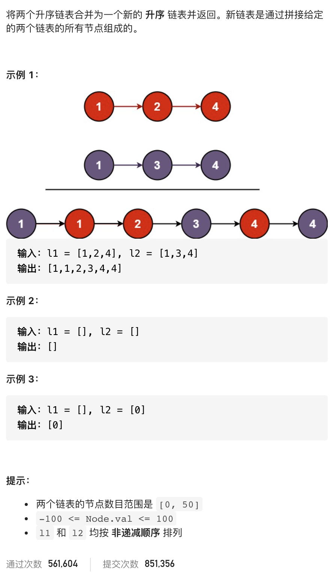

# 21.合并两个有序链表

### 难度: 简单

## 题目
------

https://leetcode-cn.com/problems/merge-two-sorted-lists/
------

将两个升序链表合并为一个新的 升序 链表并返回。
新链表是通过拼接给定的两个链表的所有节点组成的。

## 原题
------


## 解法一
------

```golang
package main

import "fmt"

type ListNode struct {
	Val  int
	Next *ListNode
}

type LinkNoder interface {
	// 后面添加
	Add(val int)
	// 删除指定 index  位置元素
	Delete(index int) int
	// 在指定 index 位置插入元素
	Insert(index int, val int)
	// 获取链表长度
	GetLength() int
	// 查找元素位置
	Search(val int) int
	// 获取指定index位置的元素
	GetVal(index int) int
	// 获取所有的元素
	GetAll() []int
}

func NewLinkNode(val int) *ListNode {
	return &ListNode{
		Val:  val,
		Next: nil,
	}
}

// 后面添加
func (head *ListNode) Add(val int) {
	point := head
	for point.Next != nil {
		point = point.Next
	}
	node := NewLinkNode(val)
	point.Next = node
}

// 删除指定 index  位置元素
func (head *ListNode) Delete(index int) int {
	if index < 0 || index > head.GetLength() {
		return -1
	}
	point := head
	for i := 0; i < index; i++ {
		point = point.Next
	}
	data := point.Next.Val
	point.Next = point.Next.Next
	return data
}

// 在指定 index 位置插入元素
func (head *ListNode) Insert(index int, val int) {
	if index < 0 || index > head.GetLength() {
		fmt.Println("insert value failed")
		return
	}
	point := head
	for i := 0; i < index-1; i++ {
		point = point.Next
	}
	newNode := &ListNode{Val: val}
	newNode.Next = point.Next
	point.Next = newNode
}

// 获取链表长度
func (head *ListNode) GetLength() int {
	length := 0
	point := head
	for point.Next != nil {
		point = point.Next
		length += 1
	}
	length += 1
	return length
}

// 查找元素位置
func (head *ListNode) Search(val int) int {
	point := head
	index := 0
	for point.Next != nil {
		if point.Val == val {
			return index
		} else {
			point = point.Next
			index += 1
		}
	}
	if point.Val == val {
		return index
	}
	return -1
}

// 获取指定index位置的元素
func (head *ListNode) GetVal(index int) int {
	if index < 0 || index > head.GetLength() {
		return -1
	}
	point := head
	for i := 0; i < index-1; i++ {
		point = point.Next
	}
	return point.Val
}

// 获取所有的元素
func (head *ListNode) GetAll() []int {
	if head.Next == nil {
		return nil
	}
	var list []int
	point := head
	for point.Next != nil {
		list = append(list, point.Val)
		point = point.Next
	}
	return list
}

func InitLinkNodes(values []int) *ListNode {
	if len(values) == 0 {
		return nil
	}
	head := NewLinkNode(0)
	for i, _ := range values {
		fmt.Println("value:", values[i])
		head.Add(values[i])
	}
	return head
}

func PrintLinkNodes(l *ListNode) {
	if l == nil {
		panic("list is nil")
		return
	}
	point := l
	for point.Next != nil {
		if point.Next.Next != nil {
			fmt.Printf("%v -> ", point.Val)
		} else {
			fmt.Printf("%v -> ", point.Val)
			fmt.Printf("%v -> nil\n", point.Next.Val)
		}
		point = point.Next
	}
}

func mergeTwoLists(l1 *ListNode, l2 *ListNode) *ListNode {
	if l1 == nil {
		return l2
	}
	if l2 == nil {
		return l1
	}
	var res *ListNode
	if l1.Val >= l2.Val {
		res = l2
		res.Next = mergeTwoLists(l2.Next, l1)
	} else {
		res = l1
		res.Next = mergeTwoLists(l1.Next, l2)
	}
	return res
}

func main() {
	fmt.Println("vim-go")

	var nodes1 = []int{1, 2, 4}
	var nodes2 = []int{1, 3, 4}
	var l1 *ListNode
	var l2 *ListNode
	var l3 *ListNode
	l1 = InitLinkNodes(nodes1)
	l2 = InitLinkNodes(nodes2)
	PrintLinkNodes(l1)
	PrintLinkNodes(l2)

	l3 = mergeTwoLists(l1, l2)

	PrintLinkNodes(l3)
}
```
