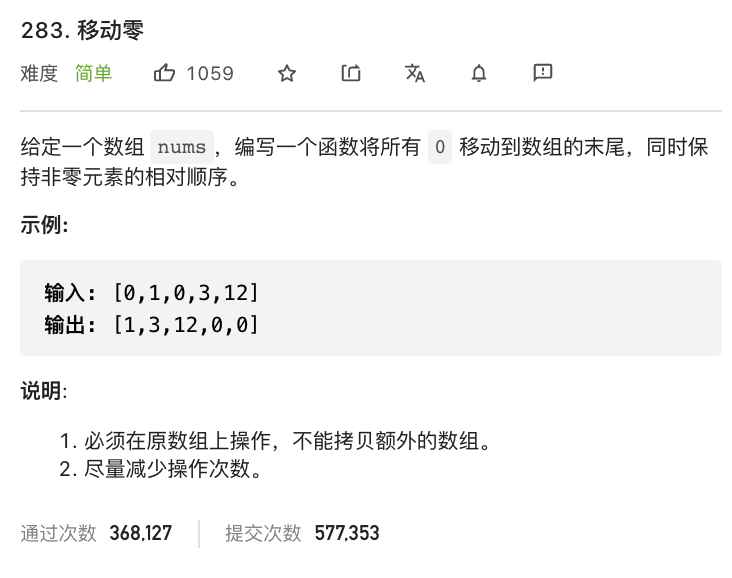

# 283.移动零

### 难度: 简单

## 题目
------

https://leetcode-cn.com/problems/move-zeroes/
------

## 原题
------


## 解法一
------

```golang
package main

import "fmt"

func moveZeroes(nums []int) {
	length := len(nums)
	j := 0
	for i, v := range nums {
		if v != 0 {
			nums[j] = nums[i]
			j += 1
		}
	}
	for j < length {
		nums[j] = 0
		j += 1
	}
}

func main() {
	fmt.Println("vim-go")
	arr := []int{0, 1, 0, 3, 12}
	fmt.Println("原数组:", arr)
	moveZeroes(arr)
	fmt.Println("处理后:", arr)
}
```

