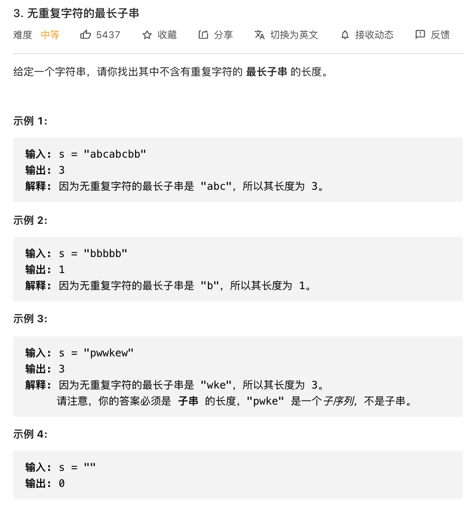

# 3.无重复字符的最长子串

### 难度: 中等

## 题目
------

https://leetcode-cn.com/problems/longest-substring-without-repeating-characters/
------

## 原题
------



## 实现方法
------

```golang
package main

import "fmt"

func lengthOfLongestSubstring(s string) int {
	// 最大子串长度
	maxStrLen := 0
	//重复字符的上次出现的索引,上一个重复字符和和当前重复字符的之间的子串即有效子串
	p := 0
	// 字符下标字典
	charData := make(map[int32]int, 128)
	for i, char := range s {
		j, ok := charData[char]
		if ok {
			if j > p {
				p = j
			}
		}

		fmt.Println("char=", string(char), "i=", i, "j=", j, "maxStrLen=", maxStrLen, "p=", p)
		if i+1-p > maxStrLen {
			maxStrLen = i + 1 - p
		}
		charData[char] = i + 1
	}
	return maxStrLen
}

func main() {
	fmt.Println("vim-go")
	l := lengthOfLongestSubstring("abcabcbb")
	fmt.Println("len=", l)
}
```
