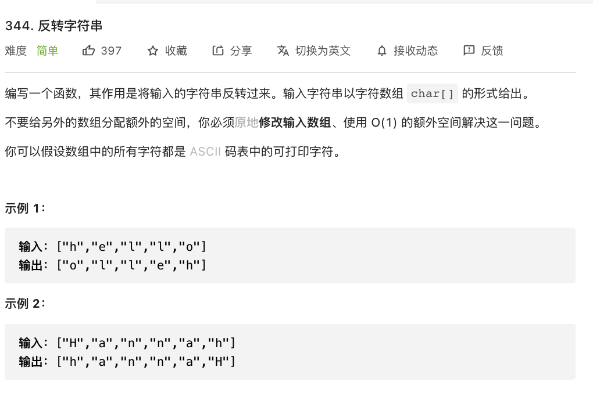

# 344. 反转字符串

### 难度: 简单

## 题目
------

https://leetcode-cn.com/problems/reverse-string/
------

## 原题
------



## 实现方法
------

```golang
package main

import "fmt"

func reverseString(s []byte) {
	length := len(s)
	for i := 0; i < length/2; i++ {
		s[i], s[length-1-i] = s[length-1-i], s[i]
	}
}

func main() {
	fmt.Println("vim-go")
	//var str []byte = []byte{'a', 'b', 'c'}
	var str []byte = []byte{'h', 'e', 'l', 'l', 'o'}
	fmt.Println("old     string:", str, string(str))
	reverseString(str)
	fmt.Println("reverse string:", str, string(str))
	var str1 []byte = []byte{'a', 'b', 'c', 'd', 'e', 'f', 'g'}
	fmt.Println("old     string:", str1, string(str1))
	reverseString(str1)
	fmt.Println("reverse string:", str1, string(str1))
}
```
