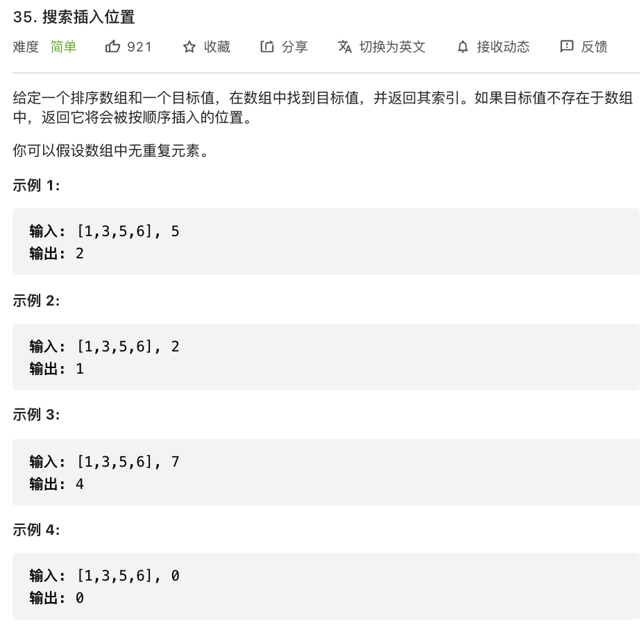

# 35.搜索插入位置

### 难度: 简单

## 题目
------

https://leetcode-cn.com/problems/search-insert-position/
------

## 原题
------


## 解法一
------

```golang
package main

import "fmt"

// 这道题目，要在数组中插入目标值，无非是这四种情况。
// 1.目标值在数组所有元素之前
// 2.目标值等于数组某个元素值
// 3.目标值插入数组中的位置
// 4.目标值在数组所有元素之后
func SearchInsert(nums []int, target int) int {
	length := len(nums)
	if length < 1 {
		return 0
	}

	left := 0
	// 定义target在左闭右闭的区间里，[left, right]
	right := length - 1

	// 当left==right，区间[left, right]依然有效
	for left <= right {
		mid := left + ((right - left) / 2)
		if nums[mid] < target {
			// target 在左区间，所以[left, middle - 1]
			left = mid + 1
		} else if nums[mid] > target {
			// target 在右区间，所以[middle + 1, right]
			right = mid - 1
		} else {
			// 目标值等于数组中某一个元素  return middle;
			return mid
		}
	}
	// 分别处理如下四种情况
	// 目标值在数组所有元素之前  [0, -1]
	// 目标值等于数组中某一个元素  return middle;
	// 目标值插入数组中的位置 [left, right]，return  right + 1
	// 目标值在数组所有元素之后的情况 [left, right]， return right + 1

	return right + 1
}

func main() {
	fmt.Println("vim-go")
	a := []int{1, 2, 4, 5, 7, 89, 99, 324}
	fmt.Println(a)
	val := 89
	b := SearchInsert(a, val)
	fmt.Println("Find:", val, " Index:", b)
}
```

