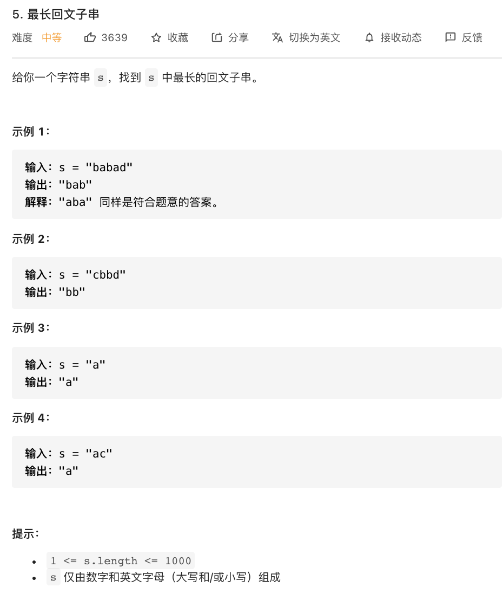

# 5.最长回文子串

### 难度: 中等

## 题目
------

https://leetcode-cn.com/problems/longest-palindromic-substring/
------

## 原题
------


## 解法一
------

```golang
package main

import "fmt"

// 中位数是一串数中大小排在中间的数，若共有奇数个数字，中位数只有一个；
// 若共有偶数个数字，中位数定义为大小排在中间的两个数的平均值。

func findMedianSortedArrays(nums1 []int, nums2 []int) float64 {
	var i, j int = 0, 0
	nums1Length := len(nums1)
	nums2Length := len(nums2)
	newNums := make([]int, 0)
	for i < nums1Length && j < nums2Length {
		if nums1[i] < nums2[j] {
			newNums = append(newNums, nums1[i])
			i += 1
		} else {
			newNums = append(newNums, nums2[j])
			j += 1
		}
	}

	if i >= nums1Length {
		newNums = append(newNums, nums2[j:]...)
	}
	if j >= nums2Length {
		newNums = append(newNums, nums1[i:]...)
	}
	totalLength := nums1Length + nums2Length
	if totalLength%2 == 0 {
		return float64(newNums[totalLength/2]+newNums[totalLength/2-1]) / 2.0
	}
	return float64(newNums[totalLength/2])
}

func main() {
	fmt.Println("vim-go")

	var ret float64 = 0.0
	nums1 := []int{1, 3}
	nums2 := []int{2}
	ret = findMedianSortedArrays(nums1, nums2)
	fmt.Println("result:", ret)

	nums3 := []int{1, 2}
	nums4 := []int{3, 4}
	ret = findMedianSortedArrays(nums3, nums4)
	fmt.Println("result:", ret)

	nums5 := []int{0, 0}
	nums6 := []int{0, 0}
	ret = findMedianSortedArrays(nums5, nums6)
	fmt.Println("result:", ret)

	nums7 := []int{}
	nums8 := []int{1}
	ret = findMedianSortedArrays(nums7, nums8)
	fmt.Println("result:", ret)

	nums9 := []int{2}
	nums10 := []int{}
	ret = findMedianSortedArrays(nums9, nums10)
	fmt.Println("result:", ret)
}
```

