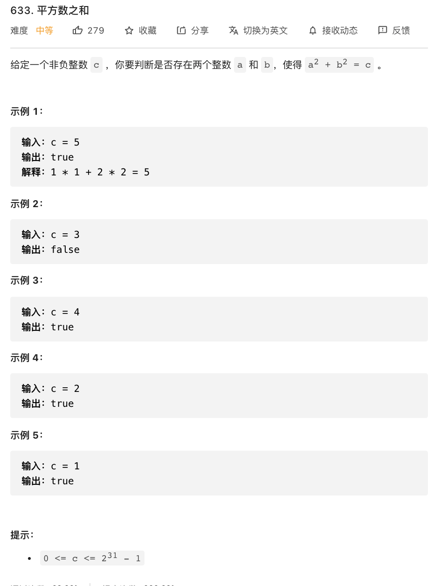

# 633. 平方数之和

### 难度: 中等

## 题目
------

https://leetcode-cn.com/problems/sum-of-square-numbers/
------

## 原题
------



## 实现方法
------

```golang
package main

import (
	"fmt"
	"math"
)

// 双指针。一个指向0，一个指向\sqrt{c}，
// 然后判断两个指针指向位置的平方和与c的大小，
// 如果大于c值一定较大指针并行更小的数，
// 否则移动较小指针指向更大的数。

func judgeSquareSum(c int) bool {
	j := int(math.Sqrt(float64(c)))
	i := 0
	for i <= j {
		diff := c - i*i
		if diff > j*j {
			i++
		} else if diff < j*j {
			j--
		} else {
			fmt.Printf("%d*%d + %d*%d = %d\n", i, i, j, j, c)
			return true
		}
	}
	return false
}

func main() {
	fmt.Println("vim-go")

	ret := judgeSquareSum(100)
	fmt.Println(ret)

	ret = judgeSquareSum(5)
	fmt.Println(ret)

	ret = judgeSquareSum(18)
	fmt.Println(ret)
}
```
