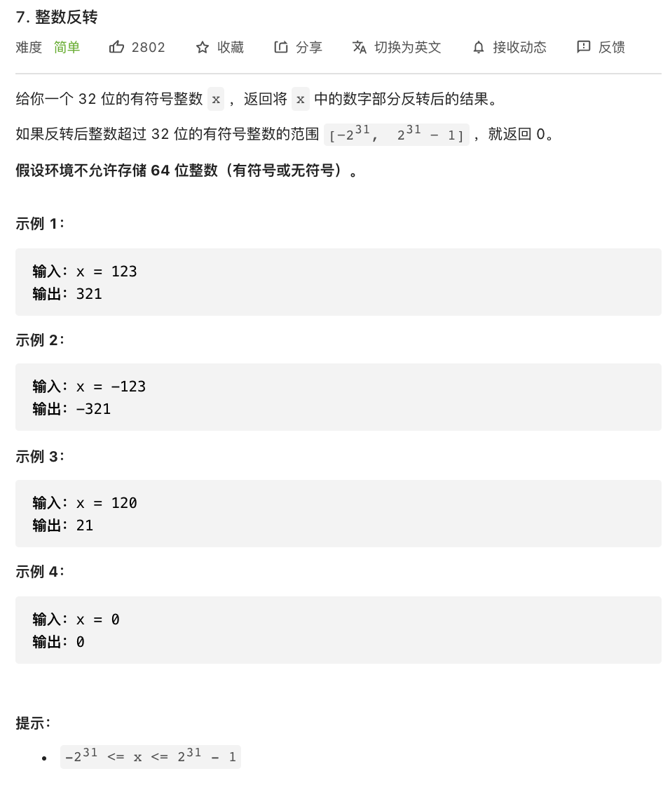

# 7.整树反转

### 难度: 简单

## 题目
------

https://leetcode-cn.com/problems/reverse-integer/
------

## 原题
------


## 解法一
------

```golang
package main

import (
	"fmt"
	"math"
)

func reverse(x int) int {
	fmt.Printf("%b, INT_MAX:%v INT_MIN:%v\n", x, math.MaxInt32, math.MinInt32)
	var n int = 0
	for x != 0 {
		n = n*10 + x%10
		x /= 10
	}
	if n > math.MaxInt32 || n < math.MinInt32 {
		return 0
	}
	return n
}

func main() {
	fmt.Println("vim-go")
	var ret, a int
	a = 123
	ret = reverse(a)
	fmt.Println(a, " => ", ret)

	a = -123
	ret = reverse(a)
	fmt.Println(a, " => ", ret)

	a = 120
	ret = reverse(a)
	fmt.Println(a, " => ", ret)

	a = 0
	ret = reverse(a)
	fmt.Println(a, " => ", ret)
}
```

