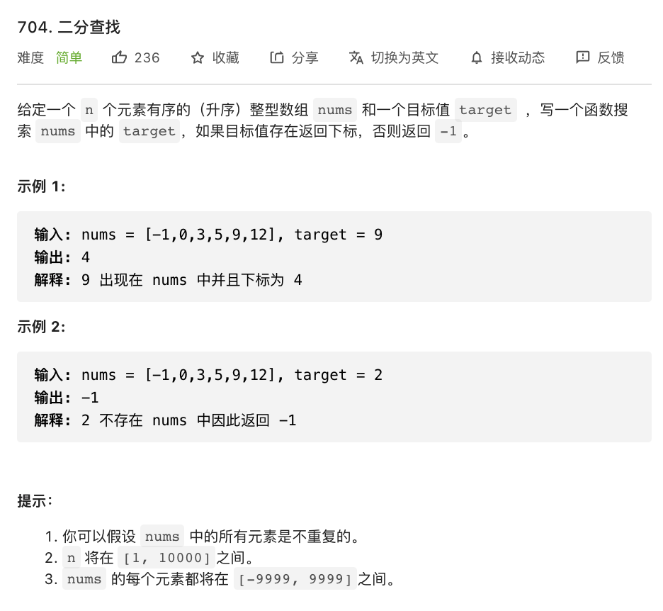

# 704.二分查找

### 难度: 简单

## 题目
------

https://leetcode-cn.com/problems/binary-search/
------

## 原题
------


## 解法一
------

```golang
package main

import "fmt"

func binarySearch(nums []int, target int) int {
	if len(nums) == 0 {
		return -1
	}
	low := 0
	mid := 0
	high := len(nums) - 1
	for low <= high {
		mid = (low + high) / 2
		if nums[mid] == target {
			return mid
		} else if nums[mid] < target {
			mid = low + 1
		} else {
			mid = high - 1
		}
	}
	return -1
}

func main() {
	fmt.Println("vim-go")

	nums := []int{-1, 0, 3, 5, 9, 12}
	fmt.Println("data:", nums)
	value := 3
	index := binarySearch(nums, value)
	fmt.Println("value=", value, " index:", index)
}
```

