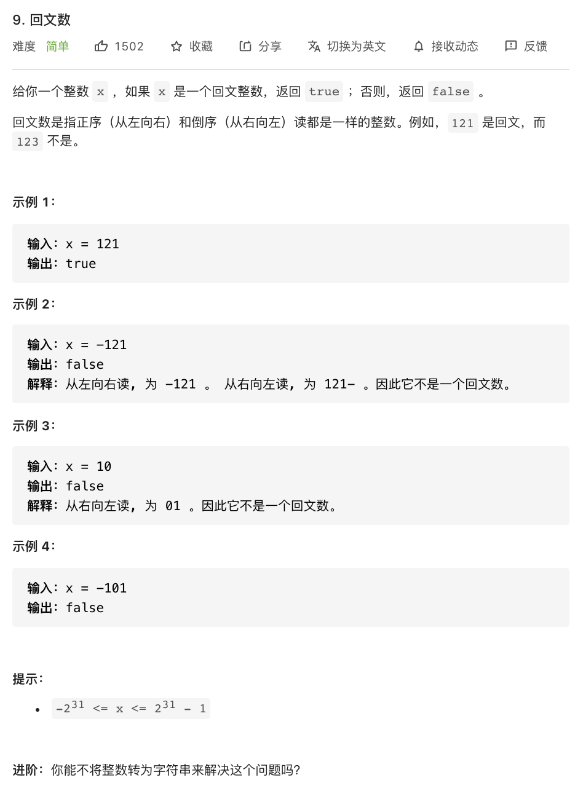

# 9.回文数

### 难度: 简单

## 题目
------

https://leetcode-cn.com/problems/palindrome-number/
------

## 原题
------


## 解法一
------

```golang
package main

import (
	"fmt"
	"strconv"
)

// 方法一:
func isPalindromeNumber(x int) bool {
	if x < 0 {
		return false
	}
	n := strconv.Itoa(x)
	length := len(n)
	fmt.Println(n, length)
	for i := 0; i < length/2; i++ {
		if n[i] != n[length-1-i] {
			return false
		}
	}
	return true
}

// 方法二:
func isPalindromeNumber1(x int) bool {
	if x < 0 {
		return false
	}
	var n int
	cmp := x // 用来做计算
	for cmp != 0 {
		n = n*10 + cmp%10
		cmp /= 10
	}
	return n == x
}

func main() {
	fmt.Println("vim-go")
	var n int

	n = 121
	fmt.Println(n, " isPalindromeNumber => ", isPalindromeNumber(n))
	fmt.Println(n, " isPalindromeNumber1 => ", isPalindromeNumber1(n))
	n = -121
	fmt.Println(n, " isPalindromeNumber => ", isPalindromeNumber(n))
	fmt.Println(n, " isPalindromeNumber1 => ", isPalindromeNumber1(n))
	n = 10
	fmt.Println(n, " isPalindromeNumber => ", isPalindromeNumber(n))
	fmt.Println(n, " isPalindromeNumber1 => ", isPalindromeNumber1(n))
	n = -101
	fmt.Println(n, " isPalindromeNumber => ", isPalindromeNumber(n))
	fmt.Println(n, " isPalindromeNumber1 => ", isPalindromeNumber1(n))
}
```

