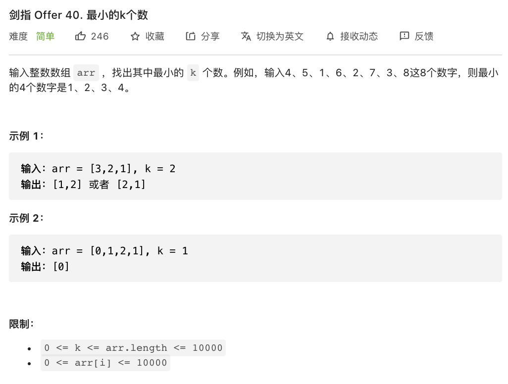

# 剑指 Offer 40.最小的K个数

### 难度: 简单

## 题目
------

https://leetcode-cn.com/problems/zui-xiao-de-kge-shu-lcof/
------

## 原题
------


## 解法一 快速排序发 查找TopK
------

```golang
package main

import "fmt"

func QuickSearch(nums []int, k int) []int {
	length := len(nums)
	if length < 2 || k > length {
		return nums
	}
	quickSearch(nums, 0, length-1, k-1)
	return nums[:k]
}

func quickSearch(nums []int, left int, right int, k int) {
	if left >= right {
		return
	}
	pivot := partition(nums, left, right)
	if pivot == k {
		return
	} else if pivot < k {
		quickSearch(nums, pivot+1, right, k)
	} else {
		quickSearch(nums, left, pivot-1, k)
	}
}

func partition(nums []int, left int, right int) int {
	mid := nums[left]
	for left < right {
		for left < right && mid <= nums[right] {
			right--
		}
		nums[left] = nums[right]
		for left < right && mid >= nums[left] {
			left++
		}
		nums[right] = nums[left]
	}
	nums[left] = mid
	return left
}

func main() {
	fmt.Println("vim-go")
	a := []int{1223, 4, 5, 12, 5, 6, 7, 7, 32, 125, 6, 7, 9}
	fmt.Println(a)
	b := QuickSearch(a, 5)
	fmt.Println(b)

	a1 := []int{0, 0, 1, 2, 4, 2, 2, 3, 1, 4}
	fmt.Println(a1)
	b1 := QuickSearch(a1, 5)
	fmt.Println(b1)
}
```

